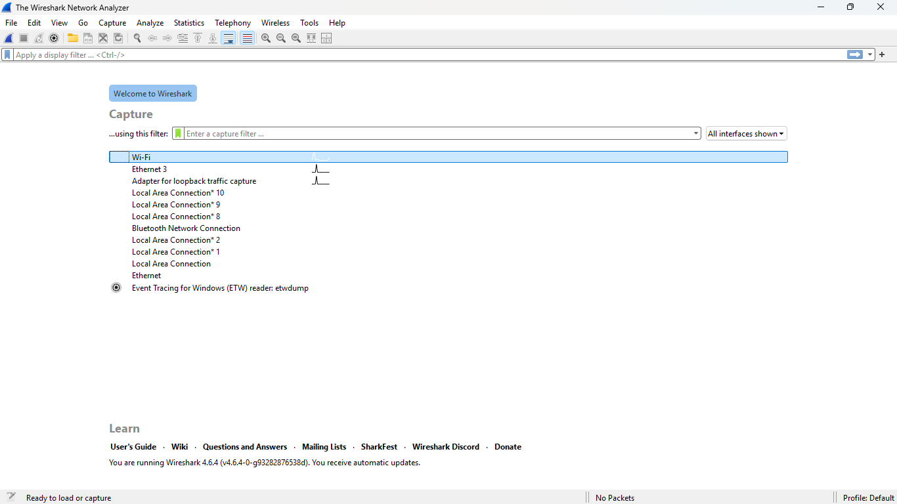
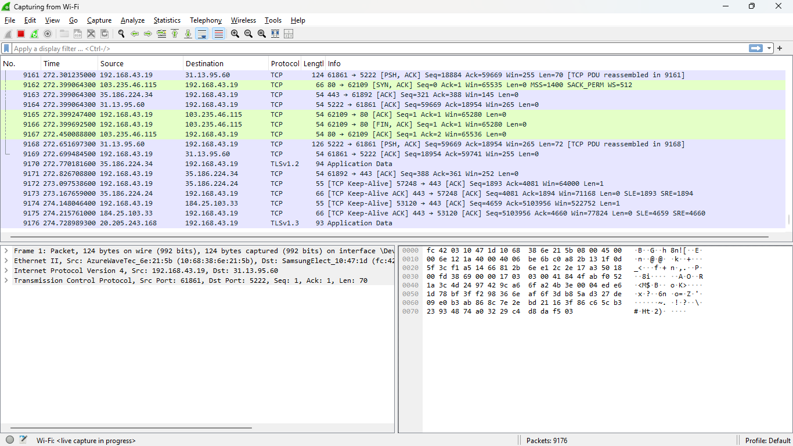
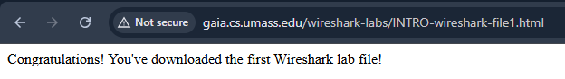
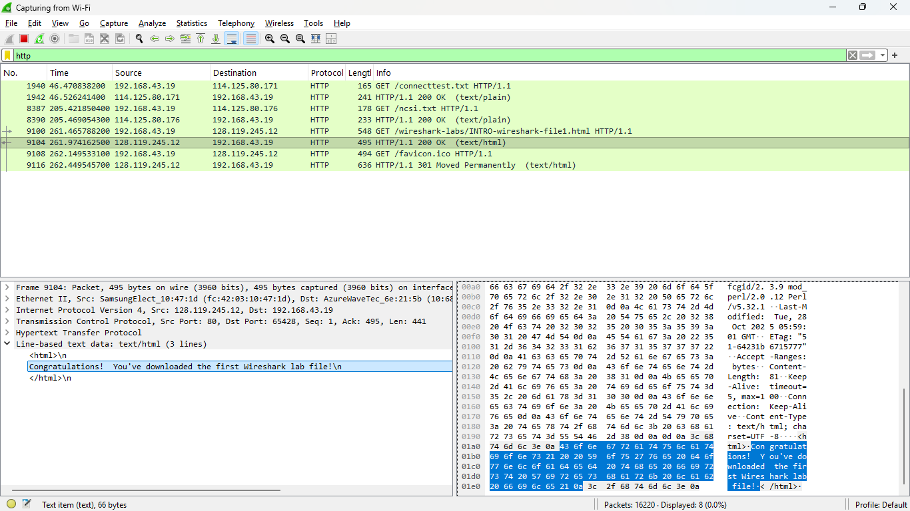

# Packet Sniffing secara real time dengan menggunakan Wireshark
 
## 1. BUKA APK WIRESHARK 
- muncul tampilan seperti pada gambar tersebut, kemudian klik wifi untuk mengecek aktivitas yang sedang berjalan menggunakan wifi
--- 

 
## 2. Analisis MOSI
- Frame: Lapisan Physical/Data Link.
- Ethernet II: Alamat MAC asal dan tujuan.
- Internet Protocol (IPv4/IPv6): Alamat IP asal dan tujuan.
- Transmission Control Protocol (TCP/UDP): Port yang digunakan (misalnya port 443 untuk HTTPS).
---

 
## 3. Cek aktivitas
- Sebagai contoh search link http://gaia.cs.umass.edu/wireshark-labs/INTRO-wireshark-file1.html pada chrome atau google.
---

## 4. Back to Wireshark
- Kembali lagi pada apk wireshark lalu klik HTTP	495	HTTP/1.1 200 OK  (text/html), kemudian lihat pada line-based text data untuk melihat isi dari website tersebut, seperti pada gambar muncul kalimat congratulations... yang di mana sesuai dengan isi website yang barusan saya kunjungi.
---