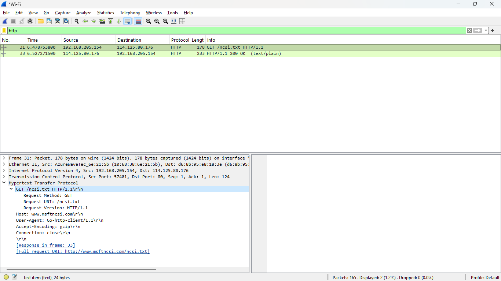
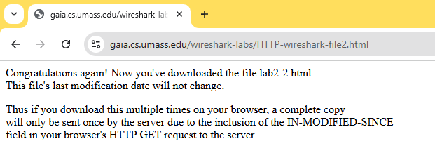
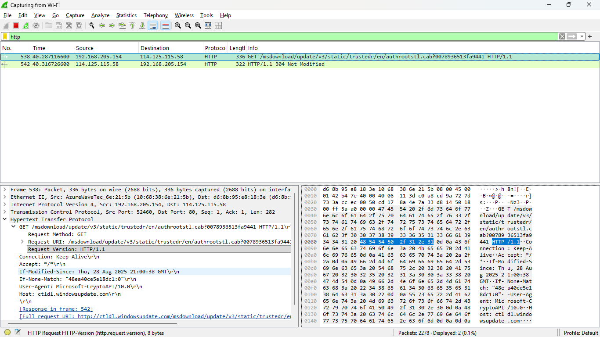
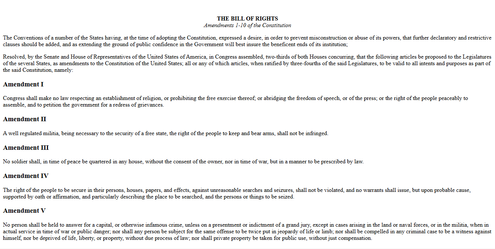
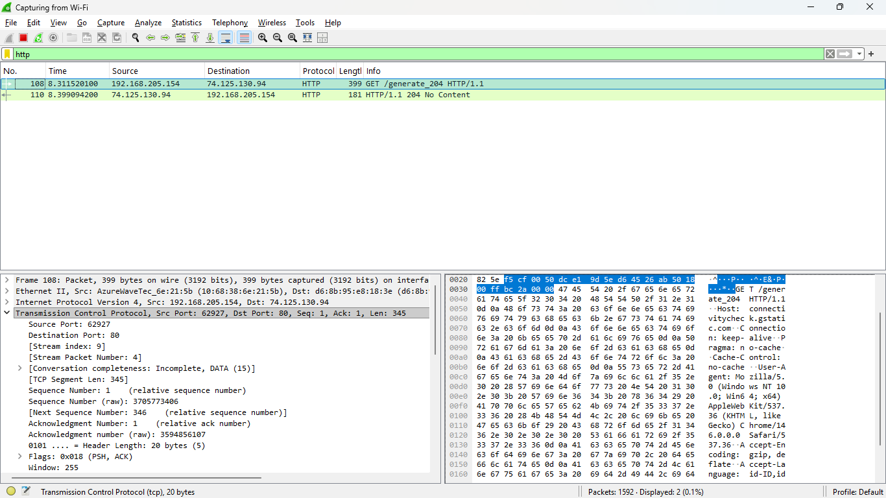
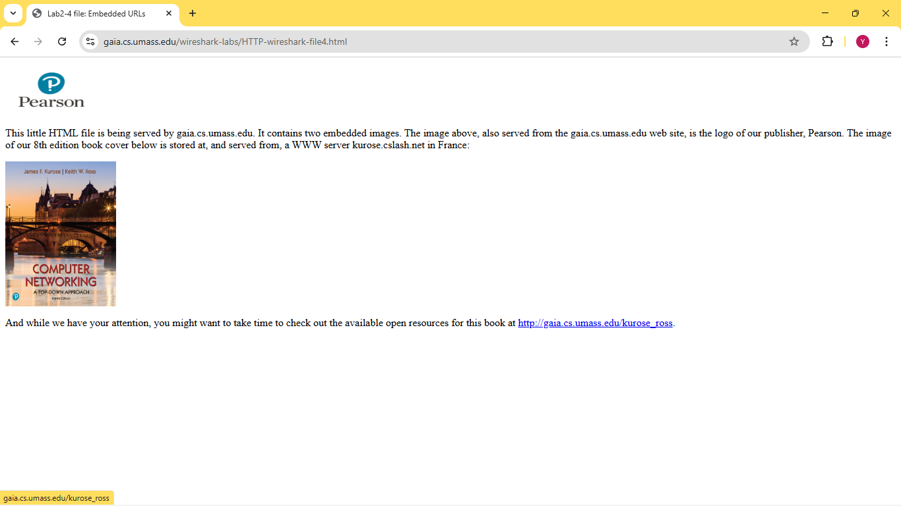
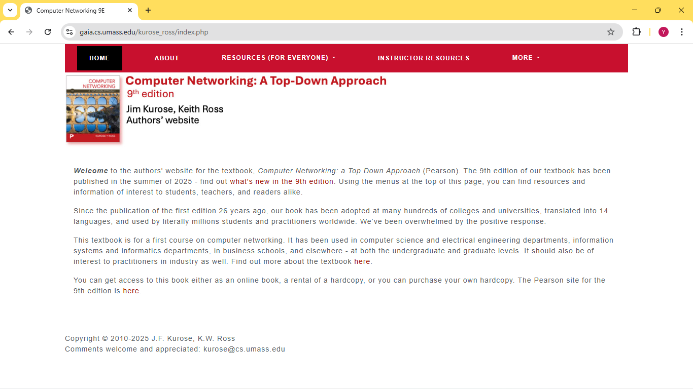
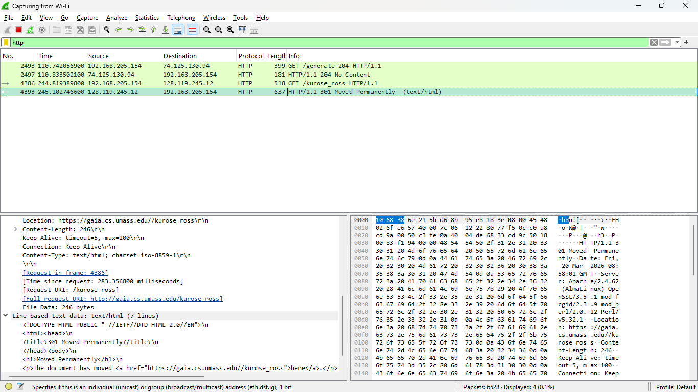

# Aspek Protokol HTTP

## 1. Eksplorasi file html1

- Search link berikut pada google chrome untuk melihat paket packagenya http://gaia.cs.umass.edu/wireshark-labs/HTTPwireshark-file1.html

- Terdapat jendela daftar paket (dua pesan HTTP ditangkap): pesan GET (dari browser ke server web gaia.cs.umass.edu) dan pesan respons dari server ke browser Jendela isi-paket yang menunjukkan rincian pesan yang dipilih (dalam hal ini pesan HTTP OK, yang disorot di jendela daftar-paket) yang di mana terdapat informasi paket _Frame, Ethernet, IP, dan TCP._

## 2. Eksplorasi file html2

- Search link berikut http://gaia.cs.umass.edu/wireshark-labs/HTTPwireshark-file2.html

- Begitu juga link file html2, terdapat 2 pesan HTTP pada jendela daftar package

## 3. Eksplorasi file html3
- Search link berikut http://gaia.cs.umass.edu/wireshark-labs/HTTPwireshark-file3.html

## 4. Eksplorasi file html4
- Search link berikut http://gaia.cs.umass.edu/wireshark-labs/HTTPwireshark-file4.html

## 5. Eksplorasi file html5

- Search link berikut http://gaia.cs.umass.edu/wiresharklabs/protected_pages/HTTP-wireshark-file5.html 

